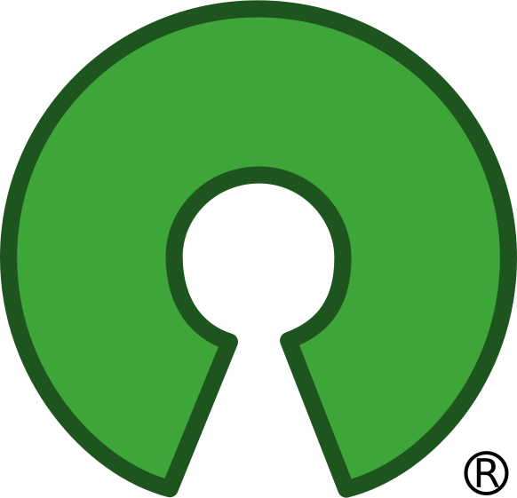
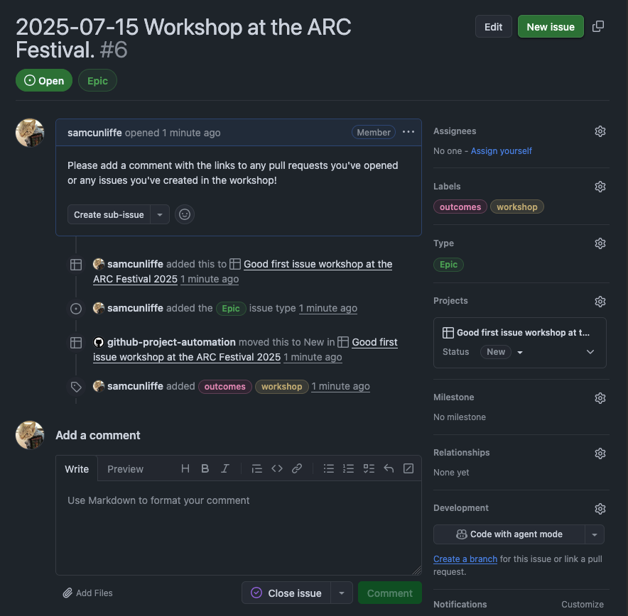

   <!-- aesthetic vspace so the title isn't too close to the UCL banner -->

# First contribution to open-source software workshop

at the ARC Festival of Digital Research, Innovation, and Scholarshop. 2025-07-15

---

<!--
paginate: true
-->

# [bit.ly/first-open](https://bit.ly/first-open)

---

# What

- Software source (and often development) is public.
- Usually complemented with a reuse-friendly license.

# Why

- Transparency, reproducibility, community, ease of working together...
- _"More perspectives make better software"_
- See also: [Turing Institute](https://www.turing.ac.uk/blog/open-source-software-why-it-matters-and-how-get-involved), [Google](https://opensource.google/documentation/reference/why).

---

<!--
_footer: Image [Wikimedia commons](https://commons.wikimedia.org/wiki/File:Screenshot_of_Overleaf.png)
-->

# Misc. examples that we bet you've used

- Languages: [Python](https://github.com/python/cpython), [R](https://cran.r-project.org/sources.html), [Rust](https://github.com/rust-lang/rust), [LaTeX]()...
- Data analysis: [TensorFlow](https://github.com/tensorflow/tensorflow), [Pandas](https://github.com/pandas-dev/pandas), [RStudio](https://github.com/rstudio/rstudio)...
- Reference management: [Zotero](https://github.com/zotero/zotero)
- Making papers, slides, etc: [Overleaf](https://github.com/overleaf/overleaf), [Inkscape](https://github.com/inkscape/inkscape), [GIMP](https://gitlab.gnome.org/GNOME/gimp)

_These_ slides were made using an open-source tool called [Marp](https://github.com/marp-team/marpit).

---

# Today

- Most (but not all) open source projects develop on [ GitHub](https://github.com).
- Most projects are happy to recieve bug reports and code change requests.
- Most (but not all) have contributor guidelines (either in `README.md` or a dedicated `CONTRIBUTING.md`).
- Most (but not all) label issues for newcomers as  s.

## Plan of action

Break up into small groups or pairs. Find something. Work on it.

---

# Rough outline of the "how"...

1. Find a project and an issue you think you can fix. Looking for the  can help.
2. Read their contributor guidelines.
3. Follow the guidelines and submit a pull request to fix the issue.

If a project doesn't have contributor guidelines, a typical workflow is:

1. [Fork] the project's repository, clone (`git clone`) your fork onto your laptop.
2. Fix the issue.
3. Commit (`git commit`) your fix, push to your fork (`git push`).
4. Open a [pull request].

[Fork]: https://docs.github.com/en/pull-requests/collaborating-with-pull-requests/working-with-forks/fork-a-repo
[pull request]: https://docs.github.com/en/pull-requests/collaborating-with-pull-requests/proposing-changes-to-your-work-with-pull-requests/about-pull-requests

---

# If you don't know what to work on

- Think if there is any software you actively use that you could contribute to.
- Use [ForGoodFirstIssue](https://forgoodfirstissue.github.com).
- We have some helpers who work on open-source projects, they are very willing to a list of  s!

## Projects

- [The Carpentries]: Markdown and HTML teaching material.
- [brainglobe]: Python code for neuroinformatics.
- [`napari`]: Python Qt image viewer.

[The Carpentries]: https://github.com/search?q=label%3A%22good+first+issue%22+is%3Aopen+org%3Aswcarpentry+org%3Acarpentries+org%3Adatacarpentry+org%3Alibrarycarpentry&type=issues
[brainglobe]: https://github.com/search?q=org%3Abrainglobe+label%3A%22good+first+issue%22++&type=issues&state=open
[`napari`]: https://github.com/search?q=repo%3Anapari%2Fnapari+repo%3Amatplotlib%2Fnapari-matplotlib+label%3A%22good+first+issue%22%2C%22contribute%3Agood+first+issue%22+is%3Aopen+&type=issues

# [Link to all of the curated issues][all]

[all]: https://github.com/search?q=repo%3AFEniCS%2Fbasix+repo%3AFEniCS%2FFFCx+repo%3AFEniCS%2Fdolfinx+repo%3ADefElement%2FDefElement+org%3ASubmitty++org%3AOpenAstronomy+org%3Aglue-viz%2Fglue+org%3Asunpy+org%3Aastropy+org%3Ayt-project++org%3Aswcarpentry+org%3Acarpentries+org%3Adatacarpentry+org%3Alibrarycarpentry+org%3Abrainglobe+repo%3Apybamm-team%2FPyBaMM+repo%3Ascikit-hep%2Fvector+repo%3Aglass-dev%2Fglass+repo%3Amatplotlib%2Fnapari-matplotlib+label%3A%22good+first+issue%22%2C%22difficulty%3A+easy%22+is%3Aopen+&type=issues

---

# End

If you're comfortable, please add a comment to [this issue](https://github.com/UCL-ARC/good-first-issue-hackathons/issues/6) with the URL(s) to any pull requests or issues you've created in this workshop!

Thanks for coming!
Sorry that there wasn't much time!
